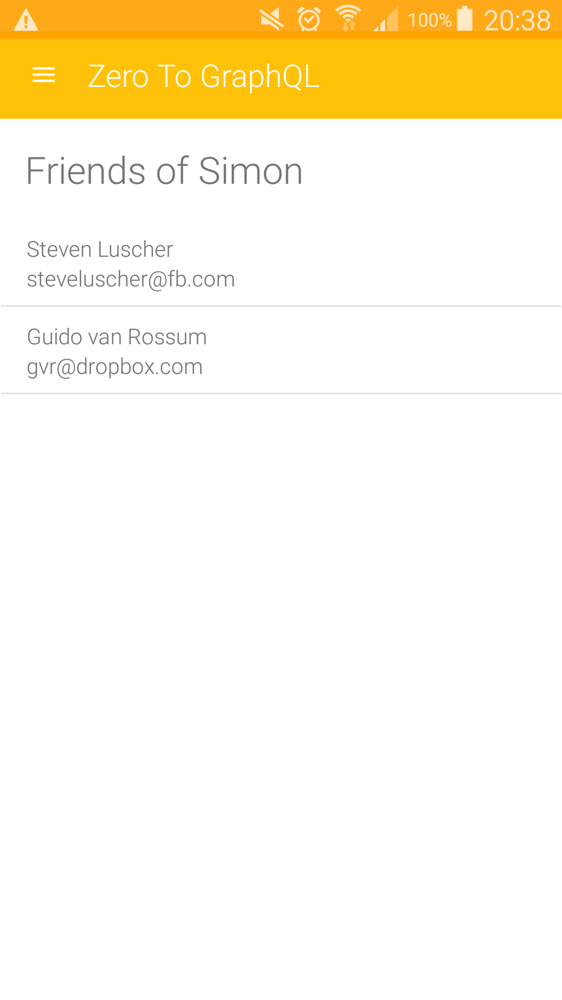
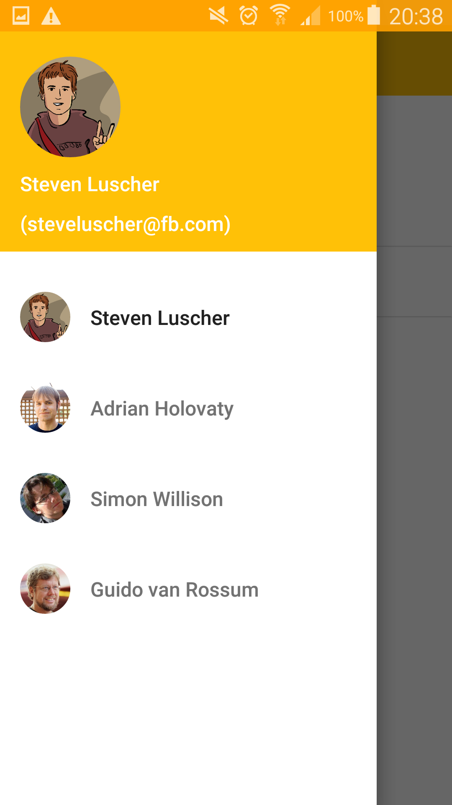

# ZeroToGraphQl app

This app is to give a simple example on how to build a React Native app based on Relay and GraphQL.
More specifically, it is using the Node's version of [zero-to-graphql](https://github.com/steveluscher/zero-to-graphql/tree/master/zero-node).



## To run this app, then you can do the following:

**Setup the Python and GraphQL servers**

1. Clone the backend stuff

    ```git clone https://github.com/steveluscher/zero-to-graphql.git```

2. Setup the backend
    ```
    cd zero-django
    ./manage.py runserver

    # now it's time to setup the GraphQL server
    cd zero-node
    npm install
    npm start # listening on port 5000
    ```

Or you can refer back to the original [zero-to-graphql GitHub page](https://github.com/steveluscher/zero-to-graphql/tree/master/zero-node).


**Run the app**

1. Clone this repo and get into the root directory
2. Install and run the app
    ```
    react-native run-android
    adb reverse tcp:8081 tcp:8081   # for listening the dev server
    adb reverse tcp:5000 tcp:5000   # for access to zero-to-graphql's GraphQL server
    npm install
    ```
